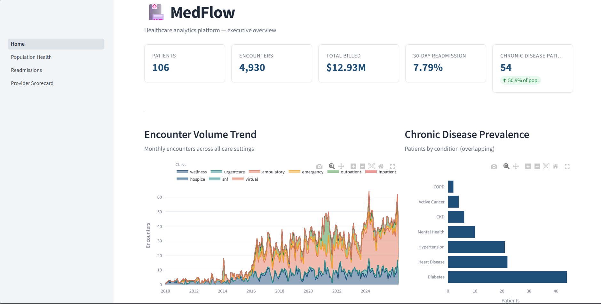
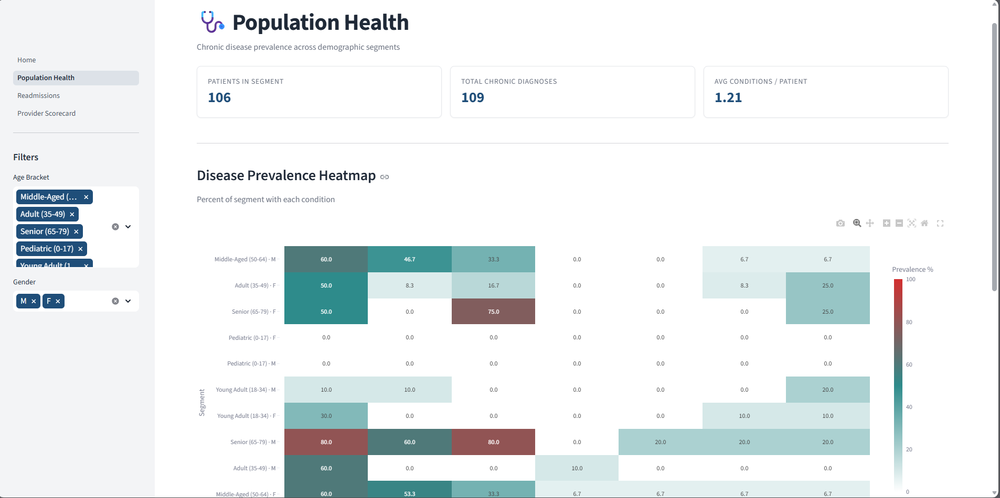
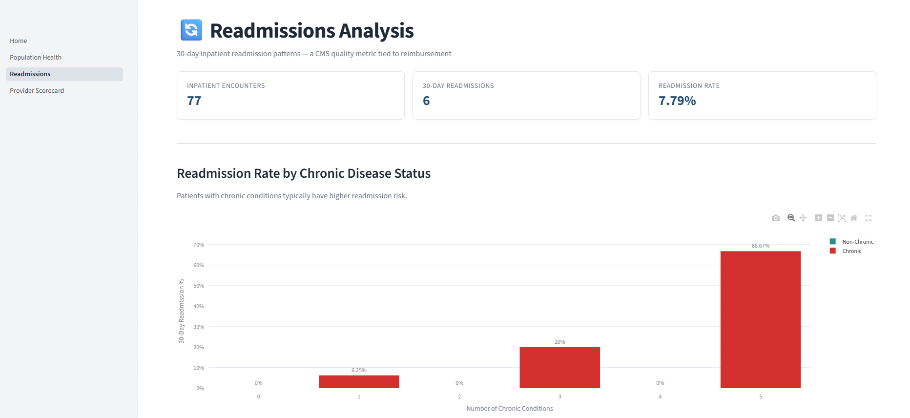
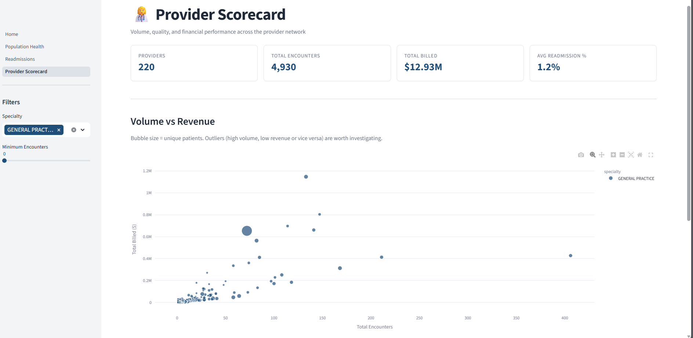
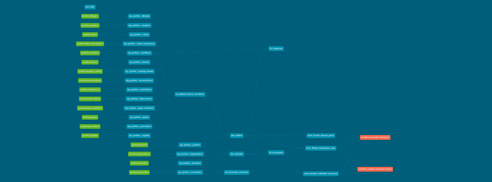

#  MedFlow — End-to-End dbt + Modern Data Stack Project

> **A complete end-to-end data engineering portfolio project** demonstrating the modern data stack from raw CSV ingestion through cloud warehousing, dimensional modeling, data quality testing, and self-service BI. Built as a reference for analytics engineering interviews and dbt project ideas. Healthcare analytics example using synthetic Synthea data.

 **[Live Dashboard](https://medflow-damini.streamlit.app)** &nbsp;·&nbsp;  **[dbt Lineage & Docs](https://daminirastogi11.github.io/medflow/)** &nbsp;·&nbsp;  **[CI Status](https://github.com/DaminiRastogi11/medflow/actions)**


---

##  What MedFlow Demonstrates

A complete analytics engineering stack built end-to-end:

- **Ingestion**: `dlt` pipeline loading 18 Synthea healthcare entities (~193K rows) into a cloud warehouse with merge-based incremental loading
- **Warehousing**: MotherDuck (cloud DuckDB) primary target with Snowflake adapter retained — warehouse-agnostic by design
- **Transformation**: `dbt-core` with staging → intermediate → marts layered architecture, dimensional model (star schema), and SCD Type 2 scaffolding on the patient dimension
- **Quality**: 108 data tests covering primary key uniqueness, referential integrity across the patient → encounter → claim graph, accepted-values constraints, and configurable thresholds
- **Orchestration & CI/CD**: GitHub Actions runs `dbt build` on every pull request; dbt docs auto-deploy to GitHub Pages on every merge to `main`
- **Visualization**: Multi-page Streamlit dashboard reading from the dbt marts, with executive KPIs, population health heatmaps, readmission analysis, and provider scorecards

##  Architecture

```mermaid
flowchart LR
    A[Synthea CSVs<br/>18 files · 193K rows] -->|dlt| B[(MotherDuck<br/>raw schema)]
    B -->|dbt staging| C[18 Staging Views<br/>typed · renamed · tested]
    C -->|dbt intermediate| D[Ephemeral CTEs<br/>chronic flags · readmission logic]
    D -->|dbt marts core| E[Star Schema<br/>3 dims · 2 facts]
    E -->|dbt marts analytics| F[Analytical Marts<br/>readmissions · chronic · providers]
    F -->|dbt exposures| G[Streamlit Dashboard]
    F -->|dbt exposures| H[Power BI Reports]

    style A fill:#FFE4B5,stroke:#1F4E79,stroke-width:2px
    style B fill:#B3D9FF,stroke:#1F4E79,stroke-width:2px
    style C fill:#B3D9FF,stroke:#1F4E79,stroke-width:2px
    style D fill:#D4D4D4,stroke:#1F4E79,stroke-width:2px,stroke-dasharray: 5 5
    style E fill:#9FE2BF,stroke:#1F4E79,stroke-width:2px
    style F fill:#9FE2BF,stroke:#1F4E79,stroke-width:2px
    style G fill:#FFB6C1,stroke:#1F4E79,stroke-width:2px
    style H fill:#FFB6C1,stroke:#1F4E79,stroke-width:2px
```



**Quality & CI/CD layer:** 108 dbt tests · GitHub Actions runs `dbt build` on every PR · dbt docs auto-deploy to GitHub Pages on merge

Five layers, each with its own materialization strategy:

| Layer | Materialization | Purpose |
|---|---|---|
| **Sources** (`raw`) | dlt-loaded tables | Raw Synthea CSV data, untouched |
| **Staging** (`staging`) | Views | Type casts, snake_case renaming, audit columns |
| **Intermediate** (`intermediate`) | Ephemeral CTEs | Reusable business logic (chronic conditions, readmission flags) |
| **Marts — Core** (`marts`) | Tables | Star schema: dim_patient, dim_provider, dim_date, fct_encounters, fct_diagnoses |
| **Marts — Analytics** (`marts`) | Tables | Executive-ready: readmission rates, chronic disease panel, provider scorecard |

##  Dashboard Preview

The live Streamlit app surfaces the marts through four interactive pages:

### Executive Overview


### Population Health


### Readmissions Analysis


### Provider Scorecard


##  Data Lineage

Auto-generated by dbt, deployed to GitHub Pages:



**[Browse the full interactive docs →](https://daminirastogi11.github.io/medflow/)**

##  Tech Stack

| Layer | Tool | Why |
|---|---|---|
| Ingestion | [dlt](https://dlthub.com/) | Modern Python EL with schema inference and merge semantics |
| Warehouse | [MotherDuck](https://motherduck.com/) | Cloud DuckDB — token auth, fast, dbt-compatible |
| Transformation | [dbt-core](https://docs.getdbt.com/) | SQL transformations as code, with tests and lineage |
| Quality | dbt tests | Referential integrity, value constraints, configurable thresholds |
| BI | [Streamlit](https://streamlit.io/) + [Plotly](https://plotly.com/) | Interactive Python dashboards |
| Orchestration | [Dagster](https://dagster.io/) | (local scaffolding for production orchestration) |
| Package management | [uv](https://docs.astral.sh/uv/) | Fast, modern Python package management |
| CI/CD | GitHub Actions | dbt build on every PR, docs deploy on merge |

##  Project Structure

```
medflow/
├── ingestion/                    # dlt pipelines (Synthea → warehouse)
├── transformation/medflow_dbt/   # dbt project
│   ├── models/
│   │   ├── staging/synthea/      # 18 cleaned staging views
│   │   ├── intermediate/         # Business logic CTEs (ephemeral)
│   │   └── marts/
│   │       ├── core/             # Star schema (dims + facts)
│   │       └── analytics/        # 3 analytical marts
│   └── macros/
│       └── generate_schema_name.sql
├── dashboard/                    # Streamlit app
│   ├── Home.py
│   ├── pages/
│   └── components/
├── orchestration/                # Dagster jobs (local)
├── docs/                         # Screenshots, diagrams
├── scripts/                      # Dev tooling (dbt.ps1 wrapper)
├── .github/workflows/            # CI/CD (dbt-ci, deploy-dbt-docs)
├── pyproject.toml                # Project dependencies (uv-managed)
├── uv.lock                       # Locked dependency versions
└── README.md
```

##  Quick Start

```bash
# 1. Clone
git clone https://github.com/DaminiRastogi11/medflow.git
cd medflow

# 2. Install dependencies
uv sync

# 3. Configure secrets
cp .env.example .env
# Edit .env with your MOTHERDUCK_TOKEN

# 4. Download Synthea sample data to data/raw/synthea/
# Grab the "100 Sample CSV" pack from: https://synthea.mitre.org/downloads

# 5. Ingest raw data
uv run python ingestion/synthea_pipeline.py --destination motherduck

# 6. Build the dbt models + run all 108 tests
.\scripts\dbt.ps1 build

# 7. Launch the Streamlit dashboard
uv run streamlit run dashboard/Home.py
```

## Raw Dataset

The MedFlow project uses **[Synthea](https://synthea.mitre.org/)** — a synthetic patient data generator by MITRE Corporation — as its data source.

**Dataset Details:**
- **Source**: [Synthea Downloads](https://synthea.mitre.org/downloads)
- **Sample Used**: 100-patient CSV pack (~193K rows across 18 files)
- **18 Healthcare Entities**:
  - `patients`, `encounters`, `providers`, `organizations`, `conditions`, `medications`, `allergies`, `procedures`, `observations`, `immunizations`, `careplans`, `claims`, `claim_transactions`, `devices`, `care_team_members`, `payer_transitions`, `expenses`, `supplies`
- **Data Characteristics**:
  - **100% Synthetic** — no real patient data (no PHI)
  - **Realistic** — clinically accurate healthcare events
  - **Reproducible** — seed-based generation for consistent sample sets
  - **Production-grade** — used in healthcare data engineering training and demonstrations
- **Download Size**: ~5 MB (CSV pack)
- **Load Time**: ~5–10 seconds via dlt into MotherDuck

To use a different sample size (e.g., 1K or 10K patients), download the desired CSV pack from the [Synthea downloads page](https://synthea.mitre.org/downloads), extract the files, and place them in the `data/raw/synthea/` directory, replacing the existing 100-patient sample. All dlt + dbt transformations scale automatically.

##  At a Glance

| Metric | Value |
|---|---|
| Source entities | 18 healthcare CSVs |
| Total rows ingested | 193,257 |
| dbt models | 28 (18 staging · 2 intermediate · 3 dims · 2 facts · 3 marts) |
| Data quality tests | 108 (all passing) |
| Full dbt build time | ~25 seconds |
| Dashboard pages | 4 (Home, Population, Readmissions, Providers) |
| Cost to run | $0 (free tiers throughout) |

##  What I Learned

Building MedFlow surfaced real-world engineering decisions that don't show up in tutorials:

- **Warehouse-agnostic design pays off.** When Snowflake's MFA-on-PAT requirement broke local CI, swapping to MotherDuck took one config change because dlt's destination abstraction held up. Hard-coded warehouse choices age badly.
- **Test thresholds beat binary tests.** Pure `not_null` / `relationships` tests fail too loud on real-world data. Using `warn_if: ">= 100"` on the dim_date relationship test let me surface drift without breaking CI on known source-data gaps.
- **The lockfile is the source of truth.** Streamlit Cloud silently preferred my stale `uv.lock` over `requirements.txt`, which is why plotly mysteriously wouldn't install. Lesson: `uv lock` after every dependency change, commit immediately.
- **Schema separation is one macro away.** dbt's default behavior suffixes model-level schemas onto the profile schema (`staging` + `marts` = `staging_marts`). Overriding `generate_schema_name` gives you clean physical schemas without fighting dbt's defaults.
- **Generate CI credentials at runtime.** profiles.yml stays gitignored; CI generates a fresh one with env-injected secrets each run. Same pattern scales to Dagster/Airflow in production.
- **dbt exposures are free senior-signal.** Declaring downstream consumers (Streamlit, Power BI) in YAML adds zero compute cost but gives your lineage graph immediate enterprise feel.

##  Operational Cost

Running this entire stack on free tiers:

- **MotherDuck**: Free tier (100 patient sample uses negligible compute)
- **Streamlit Community Cloud**: Free hosting
- **GitHub Actions**: 2,000 free minutes/month for public repos
- **GitHub Pages**: Free for public repos
- **Snowflake**: 30-day trial credits (adapter retained for enterprise demo)

**Total monthly cost: $0.**

##  Roadmap

Possible next iterations:

- [ ] Dagster job scheduling the dlt + dbt run on a daily cadence
- [ ] `dbt snapshot` capturing real SCD Type 2 history on patient address changes
- [ ] Great Expectations integration for column-level statistical assertions
- [ ] A LangChain-powered "ask MedFlow" natural-language SQL agent over the marts
- [ ] Power BI report rebuild of the same marts for a side-by-side BI comparison

##  Contact

Built by **Damini Rastogi** — Data / Analytics Engineer
-  [damini.info11@gmail.com](mailto:damini.info11@gmail.com)
-  [LinkedIn](https://www.linkedin.com/in/damini-rastogi-87b5a73aa/)
-  [GitHub](https://github.com/DaminiRastogi11)

---

##  License

MIT — see [LICENSE](LICENSE) for details.

**Data source**: [Synthea by MITRE Corporation](https://synthea.mitre.org/) — fully synthetic, no PHI.
